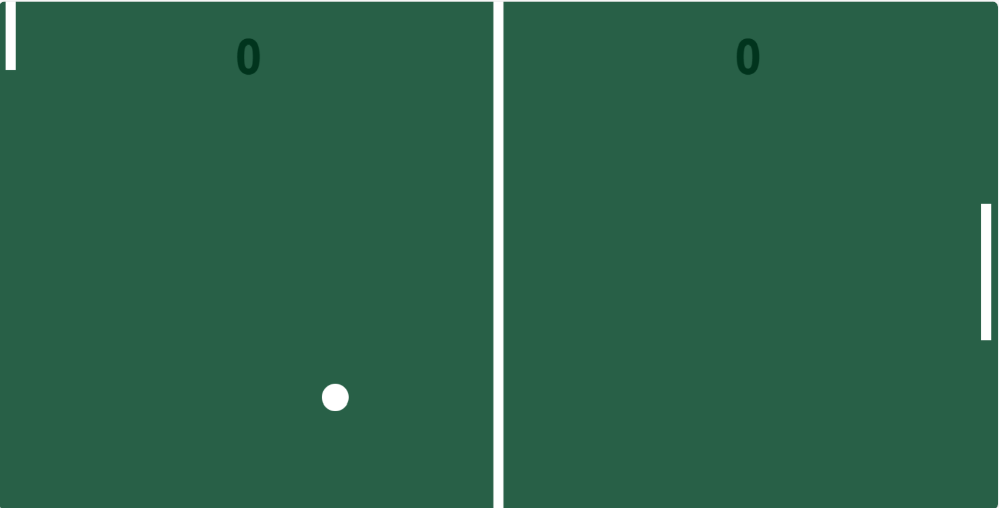

<h1 align="center">
  Ping Pong HTML JAVASCRIPT
</h1>

  

## 💻 Projeto

Nesse projeto criei um jogo de **PINGPONG** usando  _HTML_ e _JAVASCRIPT_.

## 🚀 Tecnologias

- HTML
- JAVASCRIPT

## 🚀 Créditos Tuturial

- https://st.devsamurai.com.br/0cqlvn/index.html
